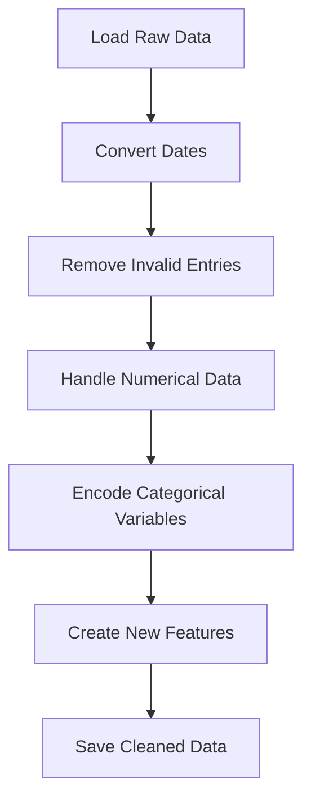

# Customer Spending Prediction Models


This repository contains various machine learning and deep learning models for predicting customer spending based on a cleaned dataset of customer information.

## Table of Contents

- [Project Overview](#project-overview)
- [Dataset](#dataset)
- [Models](#models)
- [Project Structure](#project-structure)
- [Installation](#installation)
- [Usage](#usage)
- [Results](#results)
- [Documentation](#documentation)
- [Contributing](#contributing)
- [License](#license)

## Project Overview

This project aims to predict customer spending using various machine learning techniques. We start with data cleaning and preprocessing, followed by the implementation of different models, including neural networks and traditional machine learning algorithms.

## Dataset

The original dataset (`MOCK_DATA.csv`) contains customer information, which is cleaned and preprocessed to create `cleaned_customer_data.csv`. The cleaning process includes handling date conversions, removing invalid entries, and encoding categorical variables.

### Data Cleaning Process



For detailed information on the data cleaning process, see [Data Cleaning Documentation](preprocess/info.md).

## Models

1. **Deep Neural Network**
   - Implemented using TensorFlow/Keras
   - Architecture: Multiple dense layers with dropout for regularization
   - [Deep Learning Model Details](keras/info.md)

2. **Linear Models** (Coming Soon)
3. **Ensemble Models** (Coming Soon)
4. **Tree-based Models** (Coming Soon)

## Project Structure

```
.
├── datasets/
│   ├── MOCK_DATA.csv
│   └── cleaned_customer_data.csv
├── keras/
│   ├── deeplearn.py
│   ├── info.md
│   └── notes.md
├── preprocess/
│   ├── datacleaner.py
│   └── info.md
├── README.md
└── requirements.txt
```

## Installation

1. Clone the repository:
   ```
   git clone https://github.com/yourusername/customer-spending-prediction.git
   ```

2. Install required packages:
   ```
   pip install -r requirements.txt
   ```

## Usage

1. Data Preprocessing:
   ```
   python preprocess/datacleaner.py
   ```

2. Run Deep Learning Model:
   ```
   python keras/deeplearn.py
   ```

## Results

The deep learning model achieves the following performance:

- Mean Squared Error (MSE) on test set: X.XX
- Mean Absolute Percentage Error (MAPE): XX.XX%

Detailed results and comparisons with other models will be added as they are implemented.

## Documentation

- [Data Cleaning and Preprocessing](preprocess/info.md)
- [Deep Learning Model Information](keras/info.md)
- [Neural Network Mathematics and Working](keras/notes.md)

## Contributing

Contributions to this project are welcome! Please fork the repository and submit a pull request with your proposed changes.
