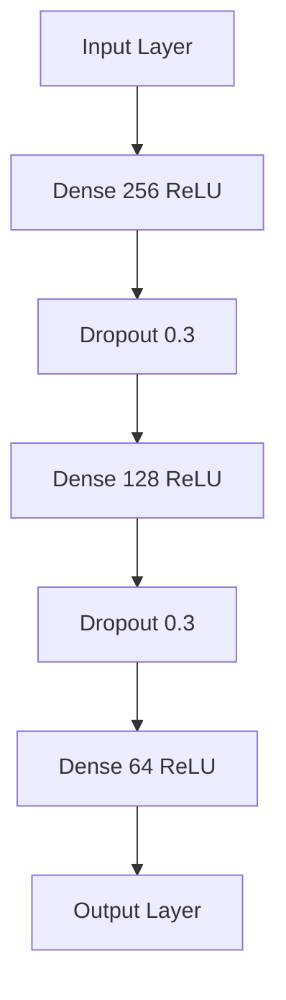

# Deep Neural Network for Customer Spending Prediction

## Table of Contents

1. [Introduction](#introduction)
2. [Data Preparation](#data-preparation)
3. [Model Architecture](#model-architecture)
4. [Training Process](#training-process)
5. [Evaluation Metrics](#evaluation-metrics)
6. [Code Breakdown](#code-breakdown)
7. [Conclusion](#conclusion)

## Introduction

This document explains a deep neural network model designed to predict customer spending based on various features. The model is implemented using TensorFlow and Keras, incorporating advanced techniques for improved performance and generalization.

## Data Preparation

### Key Steps:
1. Load data from CSV
2. Separate features (X) and target variable (y)
3. Apply log transformation to target variable
4. Split data into training and testing sets
5. Standardize features

```python
y = np.log1p(data['total_spent'])  # Log transform
X_train, X_test, y_train, y_test = train_test_split(X, y, test_size=0.2, random_state=42)
scaler = StandardScaler()
X_train_scaled = scaler.fit_transform(X_train)
```

> **Log Transformation**: Applied to handle skewed distribution of the target variable, making it more normally distributed.

> **StandardScaler**: Normalizes features to have mean=0 and variance=1, ensuring all features are on the same scale.

## Model Architecture

The neural network consists of multiple layers:



### Layer Types:

1. **Dense Layers**:
   - Fully connected layers
   - Each neuron connects to every neuron in the previous layer
   - Formula: output = activation(dot(input, kernel) + bias)

2. **Dropout Layers**:
   - Randomly sets a fraction of input units to 0 at each update during training
   - Helps prevent overfitting
   - Rate of 0.3 means 30% of inputs will be randomly set to 0

### Activation Function:

**ReLU (Rectified Linear Unit)**:
- Function: f(x) = max(0, x)
- Advantages:
  - Faster training (sparse activation)
  - Mitigates vanishing gradient problem

### Regularization:

**L2 Regularization**:
- Adds a penalty term to the loss function
- Discourages large weights
- Formula: L2_penalty = λ * sum(weight^2)

```python
Dense(256, activation='relu', kernel_regularizer=l2(0.01))
```

## Training Process

### Optimizer: Adam (Adaptive Moment Estimation)
- Combines ideas from RMSprop and Momentum
- Adapts learning rates for each parameter
- Advantages:
  - Efficient for large datasets and high-dimensional parameter spaces
  - Handles sparse gradients well

```python
model.compile(optimizer=Adam(learning_rate=0.001), loss='mean_squared_error')
```

> **Learning Rate**: 0.001 - Controls how much to adjust the model in response to the estimated error each time the model weights are updated.

### Early Stopping
- Prevents overfitting by stopping training when validation loss stops improving
- Patience of 20 epochs means training will stop if no improvement for 20 consecutive epochs

```python
EarlyStopping(monitor='val_loss', patience=20, restore_best_weights=True)
```

## Evaluation Metrics

1. **Mean Squared Error (MSE)**:
   - Average squared difference between predicted and actual values
   - Formula: MSE = (1/n) * Σ(y_true - y_pred)^2
   - Lower values indicate better model performance

2. **Mean Absolute Percentage Error (MAPE)**:
   - Average of absolute percentage errors
   - Formula: MAPE = (100/n) * Σ|((y_true - y_pred) / y_true)|
   - Provides a percentage measure of prediction accuracy

```python
mape = np.mean(np.abs((y_test_original - y_pred.flatten()) / y_test_original)) * 100
```

## Code Breakdown

<details>
<summary>Click to expand full code explanation</summary>

```python
# Import necessary libraries
import pandas as pd
import numpy as np
from sklearn.model_selection import train_test_split
from sklearn.preprocessing import StandardScaler
from tensorflow.keras.models import Model
from tensorflow.keras.layers import Input, Dense, Dropout
from tensorflow.keras.optimizers import Adam
from tensorflow.keras.regularizers import l2
from tensorflow.keras.callbacks import EarlyStopping

# Load and preprocess data
data = pd.read_csv('../datasets/cleaned_customer_data.csv')
X = data.drop(['total_spent'], axis=1)
y = np.log1p(data['total_spent'])  # Log transform

# Split and scale data
X_train, X_test, y_train, y_test = train_test_split(X, y, test_size=0.2, random_state=42)
scaler = StandardScaler()
X_train_scaled = scaler.fit_transform(X_train)
X_test_scaled = scaler.transform(X_test)

# Build the neural network model
inputs = Input(shape=(X_train.shape[1],))
x = Dense(256, activation='relu', kernel_regularizer=l2(0.01))(inputs)
x = Dropout(0.3)(x)
x = Dense(128, activation='relu', kernel_regularizer=l2(0.01))(x)
x = Dropout(0.3)(x)
x = Dense(64, activation='relu', kernel_regularizer=l2(0.01))(x)
outputs = Dense(1)(x)

model = Model(inputs=inputs, outputs=outputs)

# Compile and train the model
model.compile(optimizer=Adam(learning_rate=0.001), loss='mean_squared_error')
early_stopping = EarlyStopping(monitor='val_loss', patience=20, restore_best_weights=True)

history = model.fit(
    X_train_scaled, y_train,
    epochs=400,
    batch_size=16,
    validation_split=0.2,
    callbacks=[early_stopping],
    verbose=0
)

# Evaluate the model
train_loss = model.evaluate(X_train_scaled, y_train, verbose=0)
test_loss = model.evaluate(X_test_scaled, y_test, verbose=0)

print(f"Train MSE: {train_loss:.2f}")
print(f"Test MSE: {test_loss:.2f}")

# Make predictions and calculate MAPE
y_pred = np.expm1(model.predict(X_test_scaled))
y_test_original = np.expm1(y_test)

mape = np.mean(np.abs((y_test_original - y_pred.flatten()) / y_test_original)) * 100
print(f"Mean Absolute Percentage Error: {mape:.2f}%")
```

</details>

## Conclusion

This deep neural network model leverages advanced techniques like dropout regularization, L2 regularization, and adaptive learning rates to predict customer spending. The model's performance can be assessed through MSE and MAPE metrics, providing insights into its accuracy and generalization capabilities.

---

> **Further Improvements**:
> - Feature engineering to create more informative inputs
> - Hyperparameter tuning using techniques like grid search or random search
> - Ensemble methods to combine multiple models for improved predictions
