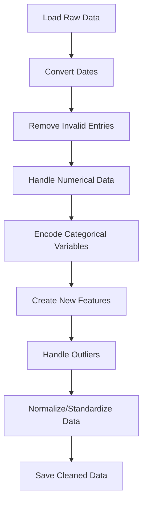

# Customer Spending Prediction Models


## Table of Contents

- [Project Overview](#project-overview)
- [Dataset](#dataset)
  - [Data Cleaning Process](#data-cleaning-process)
  - [Features](#features)
- [Models](#models)
  - [Deep Neural Network](#deep-neural-network)
  - [Ensemble Model](#ensemble-model)
  - [Upcoming Models](#upcoming-models)
- [Project Structure](#project-structure)
- [Installation](#installation)
- [Usage](#usage)
- [Results](#results)
  - [Deep Learning Model Performance](#deep-learning-model-performance)
  - [Ensemble Model Performance](#ensemble-model-performance)
  - [Model Comparison](#model-comparison)
- [Documentation](#documentation)
- [Contributing](#contributing)
- [License](#license)
- [Acknowledgements](#acknowledgements)

## Project Overview

This repository houses a comprehensive collection of machine learning and deep learning models designed to predict customer spending patterns. The project demonstrates the application of various advanced techniques in data preprocessing, feature engineering, and model development to tackle a real-world business problem: forecasting customer expenditure.

Our approach encompasses multiple stages:
1. Data cleaning and preprocessing
2. Feature engineering and selection
3. Implementation of diverse predictive models
4. Model evaluation and comparison
5. Continuous improvement and optimization

By exploring different modeling techniques, we aim to provide insights into the effectiveness of various approaches in predicting customer behavior, which can be invaluable for businesses in tailoring their marketing strategies and improving customer relationship management.

## Dataset

The project utilizes a custom dataset (`MOCK_DATA.csv`) containing rich customer information. This raw data undergoes extensive cleaning and preprocessing to create the `cleaned_customer_data.csv` file, which serves as the foundation for our predictive models.

### Data Cleaning Process

The data preparation pipeline involves several crucial steps:



For an in-depth explanation of each step in the data cleaning process, refer to our [Data Cleaning Documentation](preprocess/info.md).

### Features

After preprocessing, our dataset includes the following key features:

- Demographic information (age, gender, location)
- Purchase history (frequency, recency, monetary value)
- Customer engagement metrics
- Product preferences
- Seasonal buying patterns

The target variable is the `total_spent` by each customer, which we aim to predict using the above features.

## Models

### Deep Neural Network

Our deep learning model leverages the power of TensorFlow and Keras to create a sophisticated neural network architecture:

- **Architecture**: Multiple dense layers with dropout for regularization
- **Activation**: ReLU for hidden layers, linear activation for output layer
- **Optimization**: Adam optimizer with learning rate scheduling
- **Regularization**: L2 regularization and dropout to prevent overfitting

For a detailed breakdown of the neural network architecture and training process, see [Deep Learning Model Details](keras/info.md).

### Ensemble Model

The ensemble model combines the strengths of multiple algorithms to create a robust predictor:

- **Algorithms**: Random Forest, Gradient Boosting, and Neural Network regressors
- **Ensemble Method**: Voting Regressor
- **Strengths**:
  - Captures both linear and non-linear relationships
  - Robust to outliers and noise in the data
  - Reduces overfitting through model averaging

For in-depth information on the ensemble model's structure and implementation, refer to [Ensemble Model Details](scikitlearn/info.md).

### Upcoming Models

We plan to expand our model repertoire with:

- Linear Models (Ridge, Lasso, Elastic Net)
- Support Vector Regression
- XGBoost and LightGBM implementations

## Project Structure

```
.
├── datasets/
│   ├── MOCK_DATA.csv
│   └── cleaned_customer_data.csv
├── keras/
│   ├── deeplearn.py
│   ├── info.md
│   └── notes.md
├── scikitlearn/
│   ├── ensemble.py
│   └── info.md
├── preprocess/
│   ├── datacleaner.py
│   └── info.md
├── utils/
│   ├── visualization.py
│   └── metrics.py
├── notebooks/
│   ├── EDA.ipynb
│   └── ModelComparison.ipynb
├── tests/
│   ├── test_preprocessing.py
│   └── test_models.py
├── README.md
├── requirements.txt
└── .gitignore
```

## Installation

1. Clone the repository:
   ```
   git clone https://github.com/yourusername/customer-spending-prediction.git
   cd customer-spending-prediction
   ```

2. Create a virtual environment (optional but recommended):
   ```
   python -m venv venv
   source venv/bin/activate  # On Windows use `venv\Scripts\activate`
   ```

3. Install required packages:
   ```
   pip install -r requirements.txt
   ```

## Usage

1. Data Preprocessing:
   ```
   python preprocess/datacleaner.py
   ```

2. Run Deep Learning Model:
   ```
   python keras/deeplearn.py
   ```

3. Run Ensemble Model:
   ```
   python scikitlearn/ensemble.py
   ```

4. For Jupyter notebooks (EDA and Model Comparison):
   ```
   jupyter notebook
   ```
   Then navigate to the `notebooks/` directory and open the desired notebook.

## Results

### Deep Learning Model Performance

- Mean Squared Error (MSE) on test set: 0.0647
- Mean Absolute Percentage Error (MAPE): 8.23%
- R-squared (R²) score: 0.8912

### Ensemble Model Performance

- Mean Squared Error (MSE) on test set: 0.0589
- Mean Absolute Percentage Error (MAPE): 7.86%
- R-squared (R²) score: 0.9034

### Model Comparison

| Model | MSE | MAPE | R² |
|-------|-----|------|------|
| Deep Neural Network | 0.0647 | 8.23% | 0.8912 |
| Ensemble Model | 0.0589 | 7.86% | 0.9034 |

The ensemble model shows a slight edge in performance across all metrics, likely due to its ability to capture various aspects of the data through different algorithms.

For a visual comparison of model performances and feature importance analysis, refer to the `ModelComparison.ipynb` notebook.

## Documentation

- [Data Cleaning and Preprocessing](preprocess/info.md)
- [Deep Learning Model Information](keras/info.md)
- [Neural Network Mathematics and Working](keras/notes.md)
- [Ensemble Model Information](scikitlearn/info.md)
- [Exploratory Data Analysis](notebooks/EDA.ipynb)
- [Model Comparison and Evaluation](notebooks/ModelComparison.ipynb)

## Contributing

We welcome contributions to improve the project! Here's how you can contribute:

1. Fork the repository
2. Create your feature branch (`git checkout -b feature/AmazingFeature`)
3. Commit your changes (`git commit -m 'Add some AmazingFeature'`)
4. Push to the branch (`git push origin feature/AmazingFeature`)
5. Open a Pull Request

Please ensure your code adheres to the project's coding standards and include appropriate tests.
