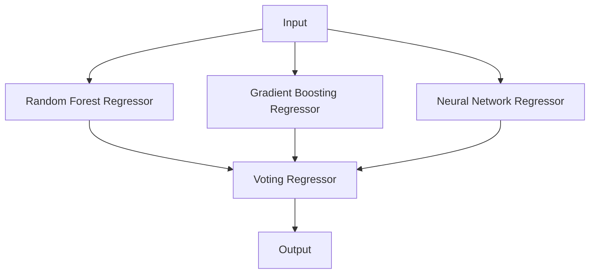

# Ensemble Learning Model for Customer Spending Prediction

## Table of Contents

1. [Introduction](#introduction)
2. [Data Preparation](#data-preparation)
3. [Model Architecture](#model-architecture)
4. [Training Process](#training-process)
5. [Evaluation Metrics](#evaluation-metrics)
6. [Code Breakdown](#code-breakdown)
7. [Conclusion](#conclusion)

## Introduction

This document explains an ensemble learning model designed to predict customer spending based on various features. The model combines Random Forest, Gradient Boosting, and Neural Network regressors using a Voting Regressor approach.

## Data Preparation

### Key Steps:
1. Load data from CSV
2. Separate features (X) and target variable (y)
3. Apply log transformation to target variable
4. Split data into training and testing sets
5. Standardize features

```python
y = np.log1p(data['total_spent'])  # Log transform
X_train, X_test, y_train, y_test = train_test_split(X, y, test_size=0.2, random_state=42)
scaler = StandardScaler()
X_train_scaled = scaler.fit_transform(X_train)
```

> **Log Transformation**: Applied to handle skewed distribution of the target variable, making it more normally distributed.

> **StandardScaler**: Normalizes features to have mean=0 and variance=1, ensuring all features are on the same scale.

## Model Architecture

The ensemble model consists of three different regressors:



### Individual Models:

1. **Random Forest Regressor**:
   - Ensemble of decision trees
   - Good for handling non-linear relationships and feature interactions

2. **Gradient Boosting Regressor**:
   - Sequential ensemble of weak learners
   - Excellent for capturing complex patterns in data

3. **Neural Network Regressor (MLPRegressor)**:
   - Multi-layer perceptron
   - Capable of learning complex non-linear relationships

### Ensemble Method:

**Voting Regressor**:
- Combines predictions from multiple models
- Final prediction is the average of individual model predictions

```python
ensemble_model = VotingRegressor([
    ('rf', rf_model),
    ('gb', gb_model),
    ('nn', nn_model)
])
```

## Training Process

The ensemble model is trained on the scaled training data:

```python
ensemble_model.fit(X_train_scaled, y_train)
```

Each individual model within the ensemble is trained simultaneously.

## Evaluation Metrics

1. **Mean Squared Error (MSE)**:
   - Average squared difference between predicted and actual values
   - Formula: MSE = (1/n) * Σ(y_true - y_pred)^2
   - Lower values indicate better model performance

2. **Mean Absolute Percentage Error (MAPE)**:
   - Average of absolute percentage errors
   - Formula: MAPE = (100/n) * Σ|((y_true - y_pred) / y_true)|
   - Provides a percentage measure of prediction accuracy

```python
mse = mean_squared_error(y_test_original, y_pred)
mape = mean_absolute_percentage_error(y_test_original, y_pred) * 100
```

## Code Breakdown

<details>
<summary>Click to expand full code explanation</summary>

```python
# Import necessary libraries
import pandas as pd
import numpy as np
from sklearn.model_selection import train_test_split
from sklearn.preprocessing import StandardScaler
from sklearn.ensemble import RandomForestRegressor, GradientBoostingRegressor, VotingRegressor
from sklearn.neural_network import MLPRegressor
from sklearn.metrics import mean_squared_error, mean_absolute_percentage_error

# Load and preprocess data
data = pd.read_csv('../datasets/cleaned_customer_data.csv')
X = data.drop(['total_spent'], axis=1)
y = np.log1p(data['total_spent'])  # Log transform

# Split and scale data
X_train, X_test, y_train, y_test = train_test_split(X, y, test_size=0.2, random_state=42)
scaler = StandardScaler()
X_train_scaled = scaler.fit_transform(X_train)
X_test_scaled = scaler.transform(X_test)

# Define individual models
rf_model = RandomForestRegressor(n_estimators=100, random_state=42)
gb_model = GradientBoostingRegressor(n_estimators=100, random_state=42)
nn_model = MLPRegressor(hidden_layer_sizes=(64, 32), max_iter=1000, random_state=42)

# Create and train the ensemble model
ensemble_model = VotingRegressor([
    ('rf', rf_model),
    ('gb', gb_model),
    ('nn', nn_model)
])
ensemble_model.fit(X_train_scaled, y_train)

# Make predictions and evaluate
y_pred = np.expm1(ensemble_model.predict(X_test_scaled))
y_test_original = np.expm1(y_test)

mse = mean_squared_error(y_test_original, y_pred)
mape = mean_absolute_percentage_error(y_test_original, y_pred) * 100

print(f"Mean Squared Error: {mse:.2f}")
print(f"Mean Absolute Percentage Error: {mape:.2f}%")
```

</details>

## Conclusion

This ensemble learning model leverages the strengths of multiple regression algorithms to predict customer spending. By combining Random Forest, Gradient Boosting, and Neural Network models, it aims to capture various patterns in the data and provide robust predictions. The model's performance can be assessed through MSE and MAPE metrics, offering insights into its accuracy and generalization capabilities.

---

> **Further Improvements**:
> - Feature engineering to create more informative inputs
> - Hyperparameter tuning for individual models using techniques like grid search or random search
> - Experimenting with different ensemble methods or adding more diverse models to the ensemble
> - Implementing cross-validation for more robust performance estimation
